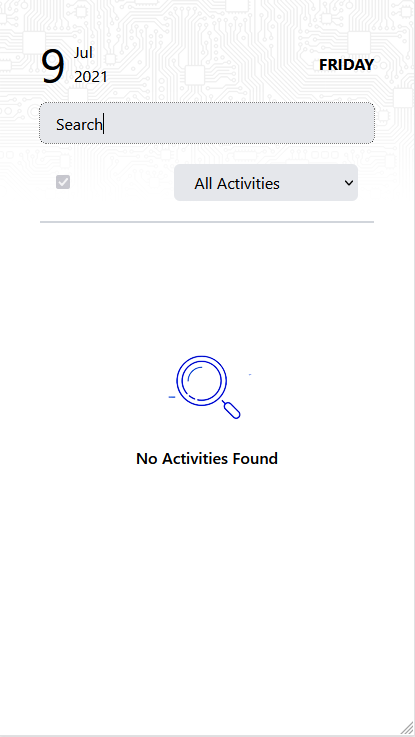

# Activity Board

This project was bootstrapped with [Create React App](https://github.com/facebook/create-react-app).

| Blank State                      | Search State                       | Todos                      | Form                             |
| -------------------------------- | ---------------------------------- | -------------------------- | -------------------------------- |
|  |  |  |  |

## Available Scripts

In the project directory, you can run:

### `yarn dev`

Runs the app in the development mode concurrently with json-server.

### `yarn test`

Launches the test runner in the interactive watch mode.

### `yarn lint && yarn type:check`

Runs a type-check runner and linter

### `yarn cypress:open`

Runs Cypress which automates the Apps workflow

# Tech stack

- React bootstrap with [create-react-app](https://create-react-app.dev/)
- [Tailwind CSS](https://tailwindcss.com/) for UI utility
- [React Query](https://react-query.tanstack.com/) for data-fetching
- [React Hook Form](https://react-hook-form.com/) for form validation
- [React Icons](https://react-icons.github.io/react-icons/) from icons
- [React Toast Notifications](https://www.npmjs.com/package/react-toast-notifications) for toaster message

# Test Stack

- [Jest](https://jestjs.io/) riding on [React testing library](https://testing-library.com/docs/react-testing-library/intro/)
- [Nock](https://www.npmjs.com/package/nock) for mocking HTTP requests
- [Cypress](https://www.cypress.io/) for End-to-End testing
